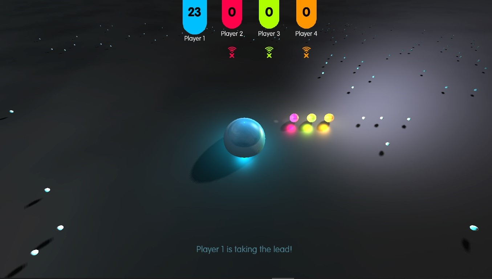

<h1 align="center">
  C++ Winsock - Multiplayer UDP
</h1>

4 player 3D "agar.io" game to showcase winsock UDP.
 

**How to Run**
-- 

- First pair of addresses will be owned by the client with the rest belonging to the other
clients. (eg. localhost:2048 localhost:2049 localhost:2050 localhost:2051)
Packets
- Packets have a base class “Packet” which contains the packetType information so that
the receiver can deduce the type of information being received.
- Ping packets are sent at prefixed intervals to determine the Round Trip Time of packets
between the client
---
**Start of Connection**
-- 
- Client starts by sending a Connection Request packet to all other clients
- The client with the lowest player index will be assigned as the “host” of the game.
- When a client requests for a connection and does not get any reply. It will instead
appoint itself as the “host” and start its own “game session”.
- The “host” is in charge of sending a Connection Reply packet to the requesting client.
- The Requesting client then replies to the Connection Reply with a Connection
Confirmation packet.
- The “host” will then notify any other connected client about the new connection upon
receiving a Connection Confirmation packet.
---
**Game play**
-- 
- Movement data packets containing information regarding the player’s movement is only
sent when a player triggers/releases a key. This is done to reduce the network traffic
compared to sending positional data every few frames.
- The movement data packets that are sent will then be used by the other clients to predict
that player’s movement within a certain expected delay. In the chance of a
mis-prediction. The Client will correctly interpolate the mis-predicted player to the correct
position.
- All clients will enter lockstep mode only when potential contention occurs. This means
whenever a player collides with anything that it can potentially interact with, all clients will
enter lockstep mode.
---
**Disconnection and Reconnection**
-- 
- If a client crashes, the rest of the clients will notice that it crashed after it has stopped
replying to a certain number of ping packets. It will then disconnect that client.
- If a client closes, it will send a Disconnect Notification to let the other client knows that it
is going to reconnect.
- If a client tries to reconnect to an existing session, the host will reply with a full state of
the game and connect to that session.
- If the host disconnects, all of the clients will reappoint a new host using the lowest player
index rule.

---

**Created by :**
-- 
- Gameplay / Dead Reckoning
  - **Choo Chi Keong Bryan**

- Lockstep protocol / Threading
  - **Kevin Hartono**
- Engine / Base Networking Setup
  - **Teo Zheng Yong Theon**
---
**Libs Used :**
-- 
- OpenGL
- GLFW
- GLEW
- FreeType
- ImGui
- GLM

